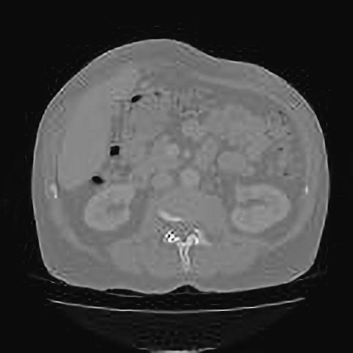

# Unet-liverCT
Unet network for liver CT image segmentation  
This work is based on [U-Net: Convolutional Networks for Biomedical Image Segmentation](https://lmb.informatik.uni-freiburg.de/people/ronneber/u-net/)
AND [unet](https://github.com/zhixuhao/unet). I develop the whole project to solve the problem of Unet network segmenting liver CT.
## Overview
### Data
The dataset [3D-IRCADb(3D Image Reconstruction for Comparison of Algorithm Database)](https://www.ircad.fr/research/computer/).This dataset
includes 20 people's liver CT images, 15 of 20 have tumors.
### Data Augmentation
I use keras.preprocessing.image to do the data augmentation in order to get enough images to train the network. You can do it or not.
### Model Architecture

### Train and Test
#### Dependencies
+ python == 2.7.15
+ tensorflow-gpu == 1.3.0
+ keras == 2.0.5  
I did not test other versions, you can have a try.
#### Training

```python trainUnet.py```
#### Testing
```python testUnet.py```
#### Evaluating
```python evaluate.py```  
The results of liver CT segmentation and tumor segmentation are based on the following indicators:**Dice coefficient** and **RVD(relative volume difference)** and **VOE(volumetric overlap error)**.
### Result



